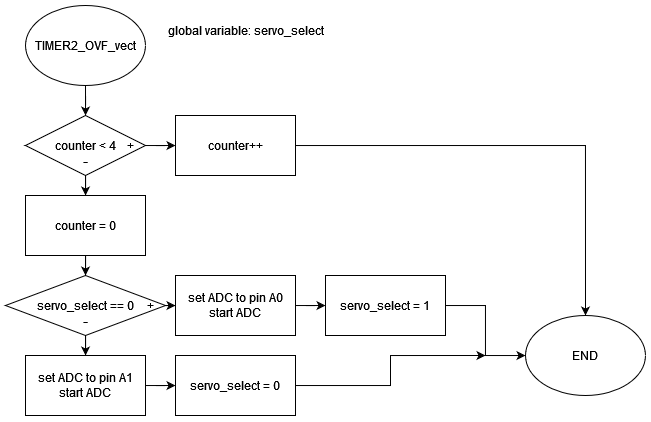

# Project 2

Precise generation of several PWM channels. Application of two (or more) Servo motors SG90.

## Instructions

The goal of the project is cooperation in pairs, further study of the topic, design of own solutions, implementation, creation of project documentation and presentation of results. The division of roles and tasks within the team is up to their members.

* Students work on a project in the labs during the 12th and 13th weeks of the semester.

* Through the BUT e-learning, students submit a link to the GitHub repository, which contains the complete project in PlatfomIO and a descriptive README file. The submission deadline is the day before the next laboratory, i.e. in 2 weeks.

* The source code for the AVR must be written in C and/or Assembly and must be implementable on Arduino Uno board using toolchains from the semester, ie PlatformIO and not in the Arduino-style. No other development tools are allowed.

## Recommended GitHub repository structure

   ```c
   YOUR_PROJECT        // PlatfomIO project
   ├── include         // Included files
   ├── lib             // Libraries
   ├── src             // Source file(s)
   │   └── main.c
   ├── test            // No need this
   ├── platformio.ini  // Project Configuration File
   └── README.md       // Report of this project
   ```

## Recommended README.md file structure

### Team members

* Adam Ondrejka
* Dominik Vaško

## Hardware description

Insert descriptive text and schematic(s) of your implementation.


## Software description

Put flowchats of your algorithm(s). Write descriptive text of your libraries and source files. Put direct links to these files in `src` or `lib` folders.





## Video

[Short video of our practical implementation.](https://www.youtube.com/watch?v=cIwn9iO3daw)

## References

1. Write your text here.
